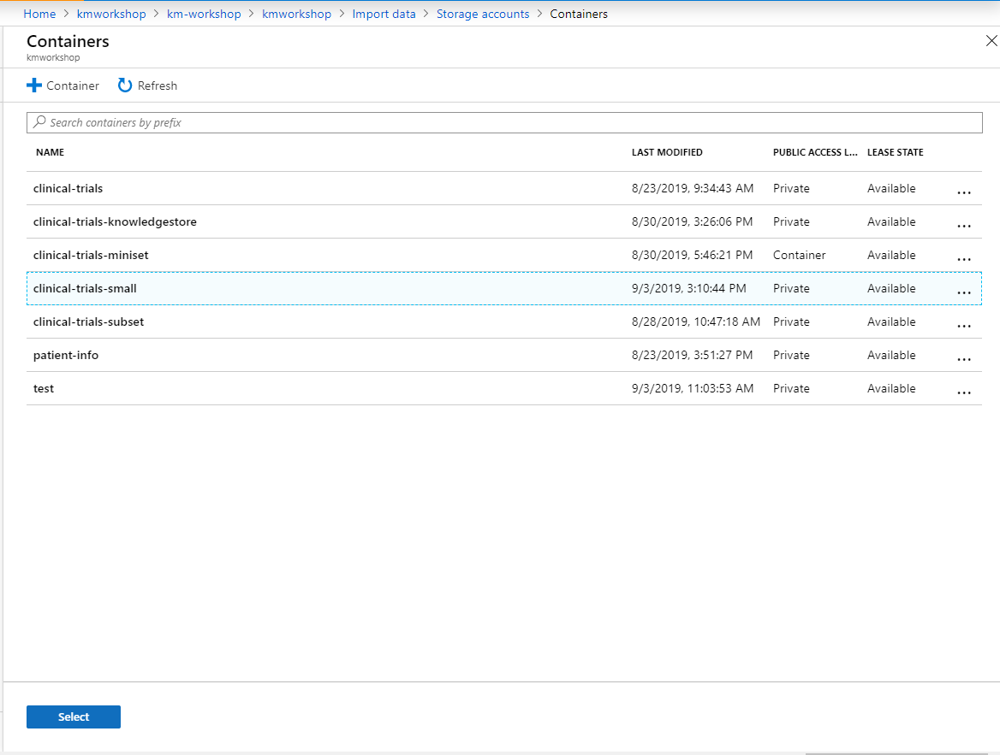
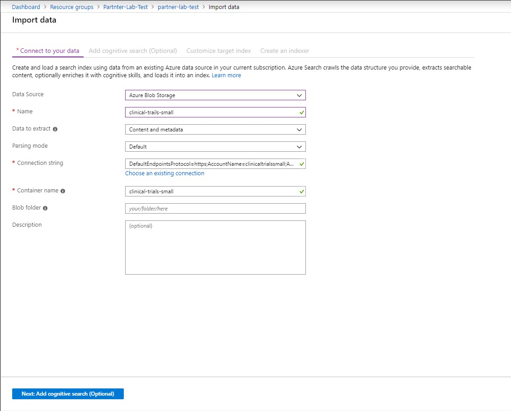
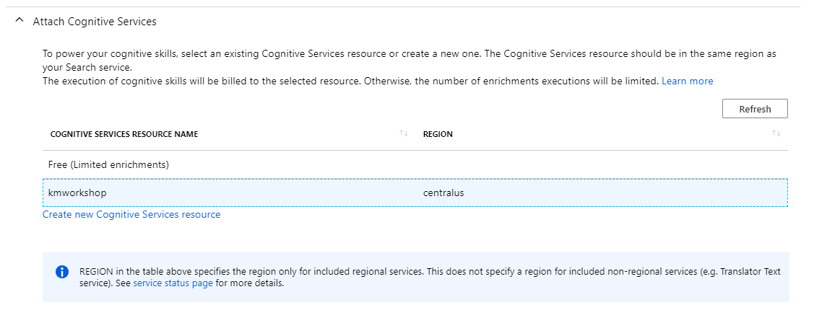
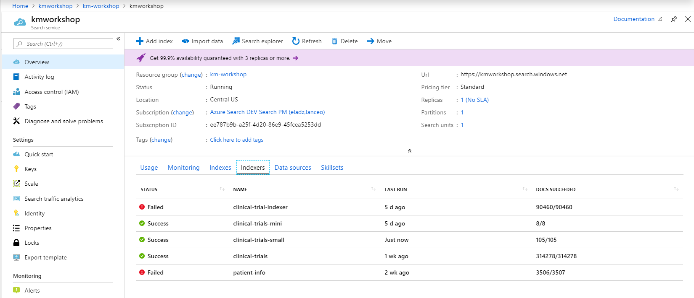

# Module 1: Using Azure Portal to Create Your Index - No Code Required

This module uses the Azure Portal to create your first Azure Search index wihtout writing any code.  Following these steps you will: ingest a set of files (clinical-trials), extract both structured and unstructured text from those files, and index their content and learn how to query your new index.  Finally, we'll use the Azure Portal to quickly build out the new (preview) capability of the Knowledge Store, which we'll explore in greater detail in Module 5.

The instructions that follow assume that you have completed all of the pre-requisites found in the [ReadMe](https://github.com/cynotebo/KM-Workshop/blob/master/README.md) to this lab and have provisioned all of the necessary resources to your Azure subscription.  If you have not already completed these steps, you will need to do so prior to moving forward.

## Using the Portal Import Data Flow:

We will now create a data source called *clinical-trials-small* that will be used to load and index the data.

1. Navigate to your search service, and click the **Import Data** button. This will launch the Import Data Wizard.

 
 
In the drop down for **Existing data source**, choose **Azure Blob Storage**.


 
2. Name your Index *clinical-trails-small*
+ **Data to Extract** set to *Content and Metadata*
3. Click on **Choose an existing connection** and select your Azure Storage Account. 

 
 
 
3. Select the clinical-trials-small container.



Your screen should now look like this:



4. Now click **Next: Add cognitive search (Optional)** to begin the steps of applying skillsets to your index.

## Skillset
In Azure Search, we call extraction and enrichment steps cognitive skills, which are combined into a skillset referenced during indexing.  In this exercise, you will be learning how to use the [built-in skills](https://docs.microsoft.com/en-us/azure/search/cognitive-search-predefined-skills) through the Azure Portal.  In a later module, we will show you how to attach these skills programattically and how to build your own [custom skills](https://docs.microsoft.com/en-us/azure/search/cognitive-search-custom-skill-interface). 


1. Attach the Cognitive Service resource you created earlier to this enrichment process. It will be used to power any of your pre-built AI models.



2. Add enrichments:

    Name your skillset: *clinical-trials-small*

3. Make sure to select the **OCR enrichment** to extract merged_content field.  Now we can apply an enrichment to the merged_content field to extract the **locations** (lowercase 'l').  For consistency’s sake, let’s call the field name locations. 


## Add a Knowledge store. 
As you recall from the introductory session, the knowledge store is a new capability that we introduced into Public Preview in May.  Using the Knowledge Store enables you to use your data in scenarios that do not lend themselves naturally to search.  Once your data has been loaded into the Knowledge Store, you can do things like kick off RPA, run analytics or visualize in tools like PowerBI.


We're going to go ahead and create the Knowledge Store now through the Azure Portal and will come back to the visualizations in a later module.

*Note - Using the Document Cracking Pipeline, you can load your data into an Azure Search Index, the Knowledge Store or both.*
1. Click choose an existing connection, select your storage account and create a container called *clinical-trials-small-ks*
2. Click **Next** to customize the target index.

3.	In the index definition, rename to it to *clinical-trials-small*,
- Make sure all the field are retrievable. 
- Make sure that the locations field is retrievable / facetable / filterable / searchable
- Optional: You can make layoutText not searchable/retrievable since we won’t need it for this workshop.

 
 
4.	Name the indexer *clinical-trials-small* (we only need to run it once for now). **Note that the index key is encoded by default*.
 


Wait 2 or 3 minutes or so for the indexing to occur – then go check the status of your indexer on the portal.  
 



## Searching the Content
Now that the content has been indexed, we can use the portal to test some search queries. Open the "search explorer" and enter a search query such as "MPS" to allow us to find all document that refer to the disease MPS, and press "Search". Try adjusting the query with different phrases and terms to get an idea of the content.
 
 
 
Let's try a few additional queries:

Search for references to "Gaucher's" disease and do hit highlighting of the content where there is a reference to it:
```
gauchers&highlight=content
```
Notice as you scroll through the results that the English - Microsoft Analyzer was able to pick up variations to this phrase such as "Gaucher" and "Gaucher's"

Add a parameter &$count=true to determine that there are 8 documents that refer to "Gaucher's" disease:
```
gauchers&highlight=content&$count=true
```

When we configured the Indexing of the content, we asked for Locations to be extracted from the content.  Let's take a look at this by searching for morquio diseaese and limiting the results to only return the metadata_title, Locations fields 
```
morquio&$select=metadata_title,Locations
```
Notice how the Locations field is a Collection (or array of strings) that includes all the Location names extracted from the content.

Let's try to group all of the Locations by using Faceting:
```
morquio&$select=metadata_title,Locations&facet=Locations
```
We can see how the search results has added a list of the top Locations and how often they are found in documents that talk about Morquio.

Finally, let's filter the results to documents that refer to Morquio and have a Location of "Emory University"
```
morquio&$select=metadata_title,Locations&$filter=Locations/any(location: location eq 'Emory University') 
```
 
### Knowledge Store Data Format
Let's look at the tables we've created in the Knowledge Store:

We see two tables, one for the documents and another one for each of the entities identified in those documents 


This data could be useful for analytics, to train an ML model, or simply to maintain a cache of any extractions we produced. In Module 3 we will create a visualization using data from the Knowledge Store.
