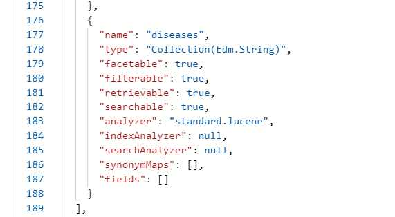

# Learn the Object Model
*Note - In this set of excersises,  you will be modifying the index created in module 1.  You will not be able to complete these steps until you have successfully completed all of Module 1.* 

In this module you will learn about the 4 main objects that allow you to get data from your data source into the index:
+ How to build and modify the index (object) programmatically. 
+ How to modifly the index you created in Module 1


As you walked though the Import Data Wizard in Module 1, it created 4 resources for you:
 


1.	The **data source** defines information about the source of your data (type of data source, how to read it, credentials, etc.)
2.	The **skillset** defines any enrichment steps [or skills ] that you apply to your data. 
3.	The **index** defines the shape of the searchable index.
4.	Finally, these 3 objects are connected by an **indexer** that orchestrates the ingestion of data from the data source, execution of the skillset and how to map the enriched data into the index.

In this module we will modify these to add a bit of extra intelligence to the system. 

## Index Definition.
Let’s change the index definition. Please be very careful because you can only make additive changes to an index. So please double-check your work, as you may not be able to edit it if you make a mistake.

###	Inspect JSON in the portal. 


Sometimes the portal makes it easy to make an edit. Or we could do it programmatically.
Let’s add a new field call diseases of type **Collection(Edm.String)** from the portal and see how what the definition looks like afterwards. Make sure it’s **Retrievable/Filterable/Facetable/Searchable**
 
 
 
+	Inspect in JSON in the Portal
 
 
 
+	**SAVE** the changes to your skillset
 


Now let’s modify the skillset to incorporate the disease extractor we built in Module 2.

First, let’s inspect what our skillset definition looks like. Bring up POSTMAN, and issue this request:

GET https://{name of your service}.search.windows.net/skillsets/clinical-trials-small?api-version=2019-05-06-Preview

 

Make sure to set the **api-key header**  based on the key you can get from the portal.

Also, note that we are using the **2019-05-06-Preview** version because we are using the Knowledge Store preview feature.

First let’s inspect the JSON.  You will notice many skills were automatically generated. There should be 4 skills that follow this general pattern:

 
 
###	Add a new custom skill.
We’ll add a step to the enrichment pipeline that extracts diseases, we’ll define where that fields get saved in the index and modify the indexer as well.


We’ll create a PUT request to edit the skillset.

PUT    https://{your-service-here}.search.windows.net/skillsets/clinical-trials-small?api-version=2019-05-06-Preview 

We’ll modify the skills list, and also add the diseases to our table projections.

###	Add the additional skill to the skillset that will extract the disease list for each document

Paste the response we got from the GET request, and add the additional skill. 

To get the URI, you will need to get it from the published skill you tested in module 2, but this is what it looked like for my skill…

```
 {
            "@odata.type": "#Microsoft.Skills.Custom.WebApiSkill",
            "name": "diseases",
            "description": "Disease Extraction Skill",
            "context": "/document",
            "uri": "<your custom skill URI here>",
            "httpMethod": "POST",
            "timeout": "PT90S",
            "batchSize": 1,
            "inputs": [
                {
                    "name": "text",
                    "source": "/document/merged_content",
                    "inputs": []
                }
            ],
            "outputs": [
                {
                    "name": "EntitiesFound",
                    "targetName": "diseases"
                }
            ]
        }

####	Modify the table projections to include this new field, as shown below:
        "projections": [
            {
                "tables": [
                    {
                        "tableName": "clinicalTrialsSmallDocument",
                        "generatedKeyName": "Documentid",
                        "source": "/document/tableprojection",
                        "sourceContext": null,
                        "inputs": []
                    },
                    {
                        "tableName": "clinicalTrialsSmallEntities",
                        "generatedKeyName": "Entitiesid",                        "source": "/document/tableprojection/Entities/*",
                        "sourceContext": null,
                        "inputs": []
                    },
                    {
                        "name": "diseases",
                        "sourceContext": "/document/diseases/*",
                        "inputs": [
                        	{
                            	"source": "/document/diseases/*",
                            	"name": "disease"
                        	}
                        ]
                	}
                ],
                "objects": []
             }
```

####	After you have made both changes, complete the PUT request.

*Note that you can create, get, edit and delete each of the resources using REST APIs, just like we did with the skillset*.

Now we’ll follow a similar process to get and modify the Indexer. 

The Indexer is the element that glues everything together. We’ll have it map this new element of the tree to our index.

Add this **outputFieldMapping to the indexer**. This will specify where in what index field to store the diseases we just extracted. Make sure to do this in the output field mappings and not just on field Mappings. Field Mappings occur before enrichment, and output field mappings occurs post enrichment.

Do a GET and then a PUT with

https://kmworkshop.search.windows.net/indexers/clinical-trials-small?api-version=2019-05-06
        {
            "sourceFieldName": "/document/diseases",
            "targetFieldName": "diseases",
            "mappingFunction": null
        }

Now, let’s reprocess documents. Go to the portal to **RESET** your Indexer and re **RUN** it.

 
 
## Search Resulting Data
 
It will take a little time to index the resulting content, however we can go to the "Search Explorer" from the portal and start looking at the resulting data.  

From your Azure Search service, choose Indexes and then click on the index you have been working with in this module.
In the query string, enter: 

```
search=*&facet=diseases
```
This tells the search engine to search all documents (*) and group the results by diseases.

