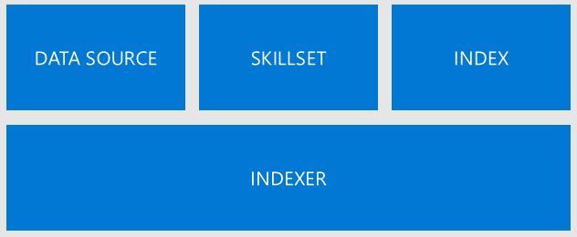
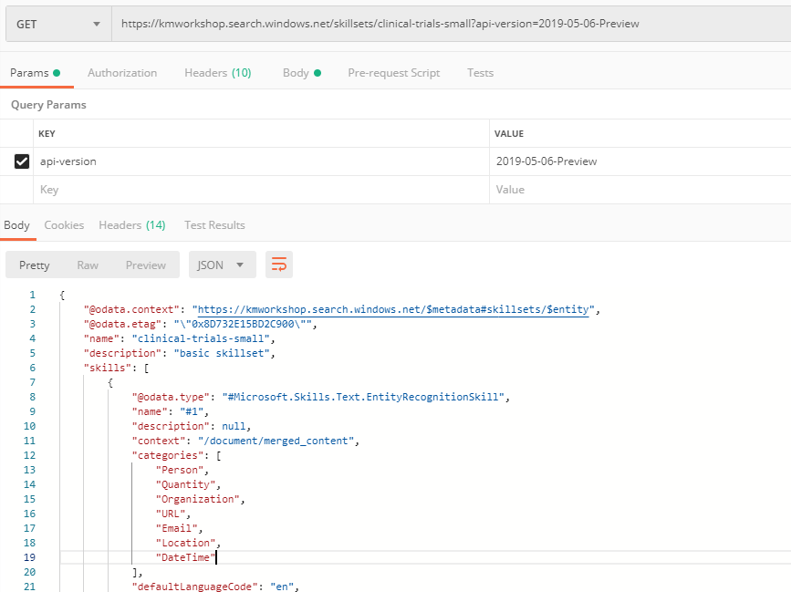
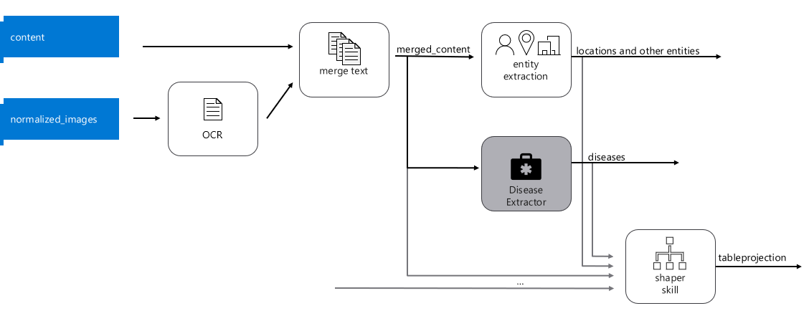
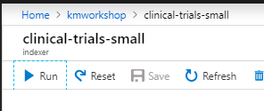

# Learn the Object Model
*Note - In this set of excersises,  you will be modifying the index created in module 1.  You will not be able to complete these steps until you have successfully completed all of Module 1.* 

In this module you will learn about the 4 main objects that allow you to get data from your data source into the index:
+ How to build and modify the index (object) programmatically. 
+ How to modifly the index you created in Module 1


As you walked though the Import Data Wizard in Module 1, it created 4 resources for you:
 


1.	The **data source** defines information about the source of your data (type of data source, how to read it, credentials, etc.)
2.	The **skillset** defines any enrichment steps [or skills ] that you apply to your data. 
3.	The **index** defines the shape of the searchable index.
4.	Finally, these 3 objects are connected by an **indexer** that orchestrates the ingestion of data from the data source, execution of the skillset and how to map the enriched data into the index.

In this module we will modify these to add a bit of extra intelligence to the system. 

## Index Definition.
Let’s change the index definition. Please be very careful because you can only make additive changes to an index. So please double-check your work, as you may not be able to edit it if you make a mistake.

###	Inspect JSON in the portal. 


Sometimes the portal makes it easy to make an edit. Or we could do it programmatically, which we will do below.

The first change we will make is to add two new fields.  The first one, called "diseases" will simply hold a collection of diseases extracted from the text.  The second field, called "diseasesPhonetic" will also hold the diseases extracted, however, it will use something called a Phonetic analyzer.  This is one of the many Custom Analyzers that Azure Search makes available, to allow you to search for words that sounds phonetically similar.  We will talk about this in much more detail later.

We can first retrieve the current index schema by opening Postman and making the following GET request:
```
GET https://{name of your service}.search.windows.net/indexes/clinical-trials-small?api-version=2019-05-06-Preview
```
For all of the subsequent requests, you will need to set the following two headers values:
* api-key: [Enter Admin API Key from Azure Search portal]
* Content-Type: application/json


Copy the index schema returned into the Body and change the request to be a POST with the following request structure.

```
POST  https://{name of your service}.search.windows.net/indexes/clinical-trials-small?api-version=2019-05-06&allowIndexDowntime=true
```

Take the resulting content returned and copy it to the body of the requests.  This will allow us to use this as the current schema.  

Next update this copied content by adding a new field:

```json
"fields": [
   ...,
   {
	"name": "diseases",
	"type": "Collection(Edm.String)",
	"searchable": true,
	"filterable": true,
	"retrievable": true,
	"sortable": false,
	"facetable": true,
	"key": false,
	"indexAnalyzer": null,
	"searchAnalyzer": null,
	"analyzer": "en.microsoft",
	"synonymMaps": []
   },
   ...
]
```

Now let’s modify the skillset to incorporate the disease extractor we built in Module 2.

First, let’s inspect what our skillset definition looks like. Bring up POSTMAN, and issue this request:

```
GET  https://{name-of-your-service}.search.windows.net/skillsets/clinical-trials-small?api-version=2019-05-06-Preview
```

 

Make sure to set the **api-key header**  based on the key you can get from the portal.

Also, note that we are using the **2019-05-06-Preview** version because we are using the Knowledge Store preview feature.

First let’s inspect the JSON.  You will notice many skills were automatically generated. There should be 4 skills that follow this general pattern:

 
 
###	Add a new custom skill.
We’ll add a step to the enrichment pipeline that extracts diseases, we’ll define where that fields get saved in the index and modify the indexer as well.




We’ll create a PUT request to edit the skillset.

```
PUT    https://{your-service-here}.search.windows.net/skillsets/clinical-trials-small?api-version=2019-05-06-Preview 
```

We’ll modify the skills list, and also add the diseases to our table projections.

###	Add the additional skill to the skillset that will extract the disease list for each document

Paste the response we got from the GET request, and add the additional skill. 

To get the URI, you will need to get it from the published skill you tested in module 2, but this is what it looked like for my skill…

```
         {
            "@odata.type": "#Microsoft.Skills.Custom.WebApiSkill",
            "name": "diseases",
            "description": "Disease Extraction Skill",
            "context": "/document",
            "uri": "<your custom skill URI here>",
            "httpMethod": "POST",
            "timeout": "PT90S",
            "batchSize": 1,
            "inputs": [
                {
                    "name": "text",
                    "source": "/document/merged_content",
                    "inputs": []
                }
            ],
            "outputs": [
                {
                    "name": "EntitiesFound",
                    "targetName": "diseases"
                }
            ]
        }
```
###  Add a new record to the Shaper Skill, and add a new Table Projection

#### Add a new diseases input into the Shaper Skill.

```
        {
            "@odata.type": "#Microsoft.Skills.Util.ShaperSkill",
            "name": "#4",
            "description": null,
            "context": "/document",
            "inputs": [
            	{
                    "name": "diseases",
                    "sourceContext": "/document/diseases/*",
                    "inputs": [
                        {
                            "name": "disease",
                            "source": "/document/diseases/*"
                        }
                    ]
                },
                {
                    "name": "lastUpdatePosted",
                    "source": "/document/lastUpdatePosted",
                    "sourceContext": null,
                    "inputs": []
                },
...
```
Remember that *document/diseases* refers to an array of strings, something like this:
```
"document/disases": ["heart failure", "morquio", ...]
```
and */document/diseases/** refers to the each of the members of that element -- each of those strings.

This skill is shaping a new complex object called *tableprojection* that will have many members.
You have just added a new member to it called *diseases*. 

Since the "sourceContext" for this new member is *"/document/diseases/\*"* , the new member itself will be an array of objects. Each of these objects will have a single member called *disease* with the name of each disease. 

It's json representation would look something like this:

```
"document/tableprojection" :
{
	"lasUptdatePosted": "August 10, 2017",
	"diseases" : [
	    {
	        "disease": "heart failure"
            },
	    {
	        "disease": "morquio"
            },
	    ...
	]
}
```

#### Modify the table projections to include this new field, as shown below:

Some tools like PowerBI know how to ingest tables and databases better than if we fed it a bunch of JSON objects.  Now that we have an object with the shape that we want, we will **project** it into a set of tables that will be correlated.

Let's add one more table to the list for our new diseases member. 

```
         "projections": [
            {
                "tables": [
                    {
                        "tableName": "clinicalTrialsSmallDocument",
                        "generatedKeyName": "Documentid",
                        "source": "/document/tableprojection",
                        "sourceContext": null,
                        "inputs": []
                    },
                    {
                        "tableName": "clinicalTrialsSmallEntities",
                        "generatedKeyName": "Entitiesid",
                        "source": "/document/tableprojection/Entities/*",
                        "sourceContext": null,
                        "inputs": []
                    },
		    {
			"tableName": "clinicalTrialsSmallDiseases",
                    	"generatedKeyName": "Diseaseid",
                    	"source": "/document/tableprojection/diseases/*",
                    	"sourceContext": null,
                        "inputs": []
                	}
                ],
                "objects": []
            }
```
When we do this, each disease extracted will be given a unique identifier (*Diseaseid*). Since "/document/tableprojection/diseases/\*" is a child of "/document/tableprojection", the diseases table will automatically also get column called "Documentid".

After you have made both changes, complete the PUT request.

```
PUT https://{your-service-name-goes-here}.search.windows.net/skillsets/clinical-trials-small?api-version=2019-05-06-Preview
```
It is important that you use version 2019-05-06*-Preview* because the knowlege store projections are still in Preview mode.

*Note that you can create, get, edit and delete each of the resources (index, data source, indexer, skillset) using REST APIs, just like you did with the skillset*.

### Update the Output Field Mappings in the Indexer

Now we’ll follow a similar process to get and modify the Indexer.  The Indexer is the element that glues everything together. 

Add this **outputFieldMapping to the indexer**. This will specify where in the index we should store the diseases we just extracted. Make sure to do this in the *output field mappings* and not on the *field mappings*. *Field mappings* occur before enrichment, and *output field mappings* occurs post enrichment.

Do a GET and then a PUT with
```
https://{your-service-name-goes-here}.search.windows.net/indexers/clinical-trials-small?api-version=2019-05-06
```

```json
    "outputFieldMappings": [
       ...,
       {
            "sourceFieldName": "/document/diseases",
            "targetFieldName": "diseases",
            "mappingFunction": null
        },
	...
 ```

This will map the diseases into two distinct fields, so that we can assign different analyzers to each of them.

Now, let’s reprocess documents. Go to the portal to **RESET** your Indexer and re **RUN** it.

 
 
## Search Resulting Data
 
It will take a little time to index the resulting content, however we can go to the "Search Explorer" from the portal and start looking at the resulting data.  

From your Azure Search service, choose Indexes and then click on the index you have been working with in this module.
In the query string, enter: 

```
search=*&facet=diseases
```
This tells the search engine to search all documents (*) and group the results by diseases.

Let's also use this new field to allow us to do a strict filter to any documents that talk about the disease "morquio"
search=*&$filter=diseases/any(disease: disease eq 'morquio')&$select=metadata_title,diseases

Try adjusting this query to only include documents that talk about 'morquio' and do not talk about 'hunter's disease'
