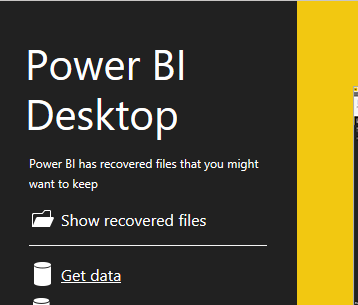
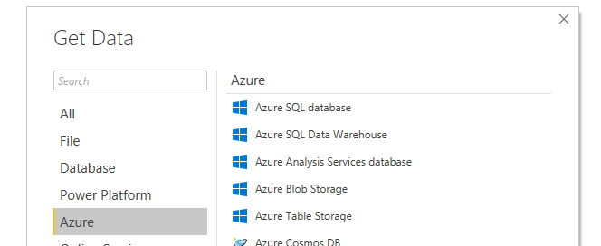
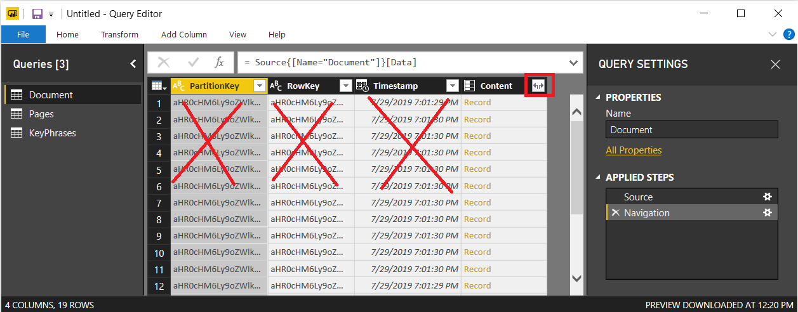

# Analyzing extracted data with PowerBI
Objective: Now that we projected information to the Knowledge Store, this structured data could be useful in scenarios that go beyond Search. In this module we’ll connect the table projections we created to PowerBI and create a few sample graphs with the extracted data.

1.	Run PowerBI desktop and click **Get Data**.
 
 
 
2.	Select **Azure Table Storage**
 
 
 
 
 
3.	When prompted, enter the key to your storage account.

4.	Select the 3 tables we just produced:
 
 
 
5.	Open **Power Query** by clicking the **Edit Queries** command.
 
 
 
6.	For Documents:
+ Remove the **PartitionKey, RowKey, and Timestamp** columns created by Azure Table storage. Knowledge store provides relationships used in this analysis.
+ Expand the **content** column.
 
 
 
7.	Change the relationships so they are bidirectional
