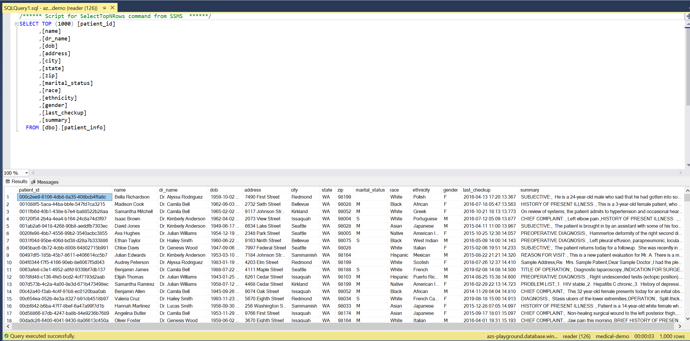

# Module 6 (Optional): Indexing data from Azure SQL

In the past 5 modules, we focused on indexing content from unstructured sources such as PDF's.  Often, there is a lot of data that exists in structured data sources such as Azure SQL or Cosmos DB which could benefit from the ability to perform full-text search.  The advantage here, is that unlike unstrutured data such as PDF's, the data has already been structured so we can make use of this through faceting and filtering.  Yet, still there is often text content that can benefit from "enrichment".  

In the below module you will take a set of purely anonymized patient data (patient name, address, notes, etc) and index it into Azure Search.  Just like in the previous module, we will leverage the Custom Skill to extract diseases from the patient notes and then create a resulting application to search the patient informmation.

## SQL Database Connection Information

If you happen to have SQL Server Management Studio, you can connect to the Azure SQL database that holds the data will be indexing, however that is not required for this module.  To connect to the database you will use the following information:

```
Server: azs-playground.database.windows.net
Database: medical-demo
User: reader
Password: EdrERBt3j6mZDP
Table: patient-info
```

Here is what the data looks like:

 
